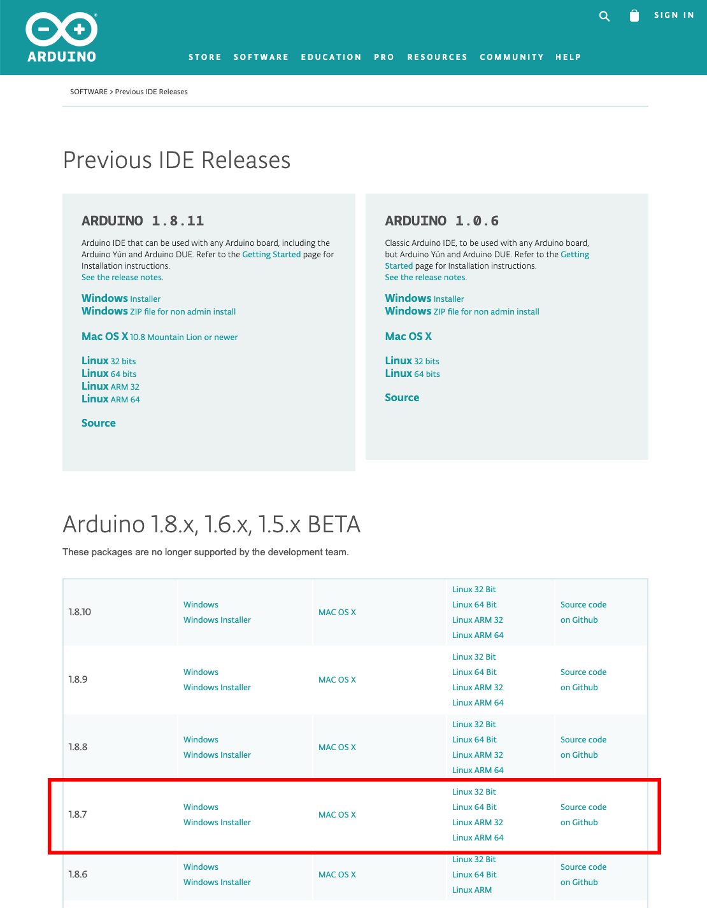

# Installation der Arduino IDE

Bevor du die senseBox über die Arduino IDE programmieren kannst, musst du Treiber sowie eine Software auf deinem Computer installieren. 

Schau dir die Anleitung für dein Betriebsystem an und folge den angegebenen Schritten.

## Arduino Software für Windows herunterladen

Die senseBox ist ein Microcontroller mit verschiedenen Komponenten und Sensoren. Sie wird über die Entwicklungsumgebung *Arduino IDE* programmiert. Lade die neueste Version 1.8.16 von der [Arduino Homepage](https://www.arduino.cc/en/Main/OldSoftwareReleases#previous) herunter:



>  	Lade bitte die zip-Datei herunter und <b> nicht </b> den Windows-Installer, um mögliche Probleme zu vermeiden!

Arduino ist ein Open-Source Projekt und wird durch Spenden finanziert. Daher wirst du vor dem Download nach einer Spende gefragt; falls du nichts spenden möchtest, kannst du auf `JUST DOWNLOAD` klicken.


Lege auf deiner Festplatte einen neuen Ordner an und entpacke darin die zip-Datei. Durch das Ausführen der Datei `arduino.exe` kann die IDE gestartet werden.  

## Arduino Software für Mac(OSX) herunterladen

> Bitte benutze Arduino Version 1.8.7 für einen reibungslosen Ablauf.

Die senseBox ist ein Microcontroller mit verschiedenen Komponenten und Sensoren. Sie wird über die Entwicklungsumgebung *Arduino IDE* programmiert. Lade die Version 1.8.7 von der [Arduino Homepage](https://www.arduino.cc/en/Main/OldSoftwareReleases#previous) herunter:


Arduino ist ein Open-Source Projekt und wird durch Spenden finanziert. Daher wirst du vor dem Download nach einer Spende gefragt; das kannst du überspringen, indem du auf `JUST DOWNLOAD` klickst.


In deinem Downloads-Ordner sollte eine Arduino.app-Datei erscheinen. Verschiebe diese Datei in deinen "Programme"-Ordner. Durch Öffnen der Datei `Arduino.app` kann die IDE gestartet werden. 

## Arduino Software für Linux herunterladen

> Bitte benutze Arduino Version 1.8.7 für einen reibungslosen Ablauf.

Die senseBox ist ein Microcontroller mit verschiedenen Komponenten und Sensoren. Sie wird über die Entwicklungsumgebung *Arduino IDE* programmiert. Lade die Version 1.8.7 von der [Arduino Homepage](https://www.arduino.cc/en/Main/OldSoftwareReleases#previous) herunter:


Arduino ist ein Open-Source Projekt und wird durch Spenden finanziert. Daher wirst du vor dem Download nach einer Spende gefragt; das kannst du überspringen, indem du auf `JUST DOWNLOAD` klickst.


### Installation der IDE unter Linux {#installation-der-ide-unter-linux}

Linux-Nutzer können die Linuxvariante herunterladen und entpacken. Das enthaltene `install.sh`-Skript legt automatisch eine Desktopverknüpfung an. Am schnellsten geht dies über das Terminal. Öffne dazu das Terminal, indem du die Tasten `Ctrl + Alt + T` drückst und gib dort die folgenden Befehle ein:

```text
# sollte die heruntergeladene Datei nicht im Downloads-Ordner abgespeichert sein, ersetze "Downloads" durch den Pfad zum entsprechenden Ordner
cd Downloads 
```

```text
# entpacke die Datei mit folgendem Befehl und installiere Arduino
tar -xvf arduino-1.8.7-linux64.tar.xz
cd arduino-1.8.7
./install.sh
```

Um den Arduino programmieren zu können, sind unter Ubuntu 14 & 16 zusätzliche Rechte notwendig. Diese können für den/die aktuelle/n Nutzer:in mit den folgenden Befehlen eingerichtet werden (benötigt Admin-Rechte):

Führe `udevadm monitor --udev` aus und schließe den Arduino per USB an, um die Device-ID zu bestimmen. Die angegebene Bezeichnung am Ende der Ausgabe (zB. `ttyUSB0`) ist die Device-ID. Beende `udevadm` per `ctrl+C`, und führe noch die folgenden Befehle aus, wobei die herausgefundene Device-ID eingesetzt werden muss:

```text
sudo usermod -a -G dialout $(whoami)
sudo chmod a+rw /dev/<device-id>
```

Nach einem Logout und erneutem Login sollte der Arduino aus der Arduino IDE programmierbar sein!

> - [Arduino](https://www.arduino.cc/)
> - [Arduino Old Releases](https://www.arduino.cc/en/software/OldSoftwareReleases#previous)

