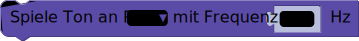

# Audio

## Spiele Ton
Mit dem `Spiele Ton`-Block kannst du Töne abspielen lassen. Unter __Pin__ wird der verwendete Pin ausgewählt und im Blockabschnitt __Frequenz__ die gewünschte Frequenz des Tons angegeben.

> Je größer die Frequenz eines Tones, desto höher höhrt er sich an.

## Schalte Ton aus
Mit dem `Schalte Ton aus`-Block kannst du einen Ton wieder ausschalten.

> - [Blockly.senseBox.de](https://blockly.sensebox.de/)