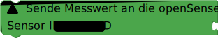

# Web - openSenseMap

## openSenseMap
Die [openSenseMap](https://www.opensensemap.org) ist ein freies Datenportal für Umweltdaten. Um Messwerte an diese senden zu können, musst du zunächst eine neue senseBox anlegen. Im Anschluss daran werden dir eine Box-ID und Sensor-IDs für jeden angegebenen Sensor angezeigt. Mehr dazu findest du im Bereich zur openSenseMap.

Um Messwerte an die openSenseMap senden zu können, musst du deine Box zuerst mit ihr verbinden. Nutze dazu den `Verbinde mit openSenseMap`-Block.

Im ersten Dropdown-Menü des Blocks kannst du auswählen, ob deine senseBox an die herkömmliche openSenseMap oder an workshop.openSenseMap senden soll.

> **opensensemap.org:** senseBoxen, die für langfristige Messreihen angelegt wurden.
>
> **workshop.opensensemap.org:** senseBoxen, die im Rahmen von kurzen Experimenten oder zum Testen angelegt wurden.

Im zweiten Dropdown-Menü des Blocks musst du auswählen, ob es sich bei deiner senseBox um eine stationäre oder eine mobile Station handelt und im Textfeld "senseBox ID" die nach der Registrierung angezeigte senseBox-ID eintragen.
Im freien Blockabschnitt `Sensoren` müssen dann die angeschlossenen Sensoren mithilfe des `Sende Messwert an die openSenseMap`-Blocks angeknüpft werden.

In diesem Block muss unter "Sensor ID" die ebenfalls nach der Registrierung angezeigte Sensor-ID angefügt werden und an den freien Bockabschnitt der jeweilige Sensor.

> **Achtung:** Die Sensor-IDs sind sensorspezifisch. Es ist also wichtig darauf zu achten, welche ID welchem Sensor/Messwert zugeordnet ist.

> - [Blockly.senseBox.de](https://blockly.sensebox.de/)