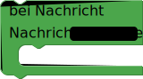

# Telegram

## Telegram
Mit [Telegram](https://www.telegram.org) kannst du einen Chatbot bauen, der dir hilft, deine senseBox von überall per Textnachricht auszulesen.

> Telegram ist ein kostenloser Messenger, der die Möglichkeit bietet auf einfachste Art Chatbots anzulegen. Um diesen nutzen zu können, benötigst du einen Telegram-Account. Bei der Erstellung deines Chatbots wird dir dann ein Token angezeigt, welches du in Blockly verwenden kannst, um dich zu authentifizieren. Mehr zur Erstellung eines Chatbots findest du im Projekt [Telegram Chatbot für die senseBox mit Blockly](https://sensebox.de/projects/de/2019-12-15-telegram-blockly).

Mit dem `Telegram Bot initialisieren`-Block wird im Setup() die senseBox darauf vorbereitet Daten auf Anfrage an den Chatbot zu senden. Im Textfeld "Token" musst du den beim Erstellen deines Chatbots angezeigten Token eintragen.

Anschließend kann mit dem Block `Telegram mache` in der Endlosschleife() programmiert werden, was genau der Chatbot ausführen soll.

Die Blöcke `Bei Nachricht` und `Sende Nachricht` können im freien Blockabschnitt des `Telegam mache`-Blocks platziert werden, um festzulegen, was die senseBox beim Empfang einer bestimmten Nachricht ausführen soll.

 

Mit dem `Bei Nachricht`-Block kann eine Aktion festgelegt werden, die die senseBox ausführen soll, wenn eine bestimmte Nachricht über Telegram eintrifft. Zum Beispiel eine LED an- oder ausschalten.

Mit dem `Sende Nachricht`-Block kann eine Nachricht über Telegram an den/die Nutzer:in des Bots gesendet werden.

> - [Blockly.senseBox.de](https://blockly.sensebox.de/)