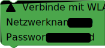
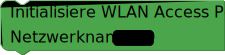

## Allgemeines
In Blockly hast du verschiedene Möglichkeiten, Projekte umzusetzen, die mit dem Internet arbeiten. Für alle musst du deine senseBox zuerst mit dem Internet verbinden.

## WiFi
Mit dem `Verbinde mit WLAN`-Block kannst du deine senseBox im Setup() mit einem WLAN-Netzwerk verbinden. Unter SSID muss der Netzwerkname und unter Passwort das WLAN-Zugangspasswort eingegeben werden.

Mit dem `Initialisiere WLAN Access Point`-Block kann deine senseBox ein WLAN-Netzwerk erstellen, in das du mit anderen Geräten beitreten kannst. Im Textfeld SSID kannst du den Namen deines Netzwerks festlegen.

> - [Blockly.senseBox.de](https://blockly.sensebox.de/)