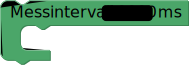

# Zeit

## Programmcode unterbrechen

## Bereits vergangene Zeit
Mit den `Bereits vergangene Zeit`-Blöcken kannst du dir die Zeit, die dein Programmcode bereits läuft, ausgeben lassen. Die Laufzeit wird in Millisekunden oder Microsekunden angegeben.

## Warte für immer
Mit dem `Warte für immer`-Block kannst du dein Programm beenden.

## Messintervall
Mit dem Block `Messintervall` kannst du festlegen, wie häufig deine Messwerte übertragen werden. Standardmäßig (also ohne Messintervall-Block) werden die Messwerte sekündlich übertragen.

- [Blockly.senseBox.de](https://blockly.sensebox.de/)

