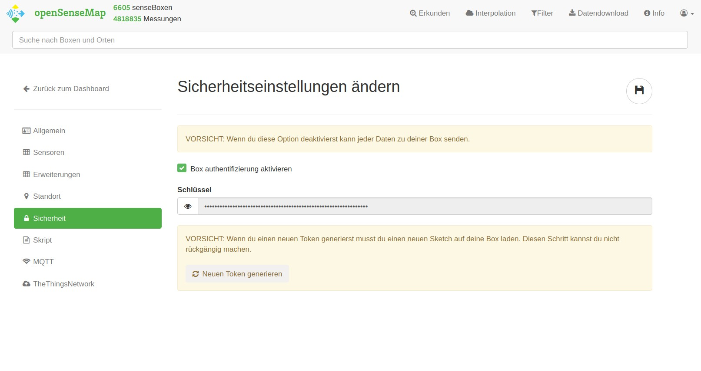

# Sicherheit

Es besteht die Möglichkeit, deine senseBox mit einem Token vor falscher Dateneingabe zu schützen. Diese Option lässt sich auf der openSenseMap in deinem Dashboard pro senseBox aktivieren oder deaktivieren. Zudem hast du dort die Möglichkeit, einen neuen Token zu generieren, falls dieser in die falschen Hände gefallen sein sollte.



## Wie wird der Token genutzt?

Sobald du die Option "Authentifizierung aktivieren" ausgewählt hast, müssen alle POST-Requests für deine senseBox an die Endpunkte `https://api.opensensemap.org/boxes/:senseBoxId/:sensorId` und `https://api.opensensemap.org/boxes/:senseBoxId/data` mit einem Authorization-Header versehen werden. Requests ohne diese Header oder mit einem falschen Token werden von der openSenseMap nicht mehr akzeptiert. So ein Header sieht wie folgt aus:

```
'Authorization' : 'YOUR_BOX_ACCESS_TOKEN'
```

## MQTT und TTN

Solltest du die Datenübertragung per MQTT oder TTN durchführen, brauchst du diesen Authentifizierungs-Token zwar nicht, es ist aber trotzdem ratsam, die Authentifizierung zu aktivieren, um zu verhindern, dass Dritte Daten zu deiner senseBox senden.
