# senseBox:home mit LoRa

## LoRa und TheThingsNetwork

Die Daten werden über das [TheThingsNetwork](https://www.thethingsnetwork.org/) (TTN) versendet. Daher muss im ersten Schritt eine **Application** und ein **Device** angelegt und eine Weiterleitung per **Webhook** der Daten zur openSenseMap eingerichtet werden. Grundsätzlich können alle Sensoren, die direkt über die openSenseMap auszuwählen sind, verwendet werden. Das Decodieren findet direkt auf der openSenseMap statt und muss **nicht** mehr über die TTN Console eingestellt werden.

## Registrieren im TheThingsNetwork

Viele Gateways, die von verschiedenen Gruppen, Vereinen oder auch Unternemhmen aufgestellt wurden, verwenden das TheThingsNetwork, um die Daten zu empfangen und zu versenden. Damit Daten innerhalb des Netzes empfangen und verabeitet werden können, müssen zuerst ein Account erstellt, eine **Application** angelegt, und die **Devices** registriert werden.

In sehr vielen Städten ist schon eine gute Abdeckung des Netzwerkes vorhanden. Eine Übersicht über die Abdeckung findest du auf [ttnmapper.org](https://ttnmapper.org/).
> Beachte hierbei jedoch, dass die Abdeckung evlt. nicht der Realität entspricht und die Daten veraltet sein könnten.

### Anlegen der Application und Erstellen eines Devices

Erstelle dir einen neuen Account unter [https://eu1.cloud.thethings.network/](https://eu1.cloud.thethings.network/). Wähle anschließend **Go to Applications**.

Du bekommst eine Übersicht über alle bereits registrierten **Applications** und kannst über **add Application** eine neue hinzufügen.

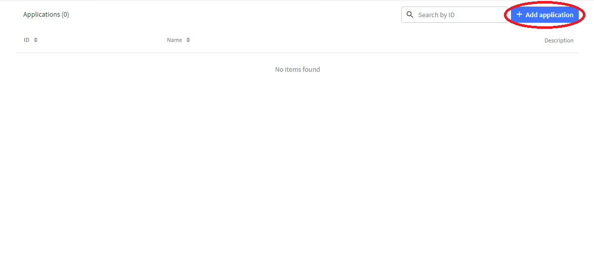

Wähle einen Namen für deine Application und füge optional eine kurze Beschreibung hinzu.

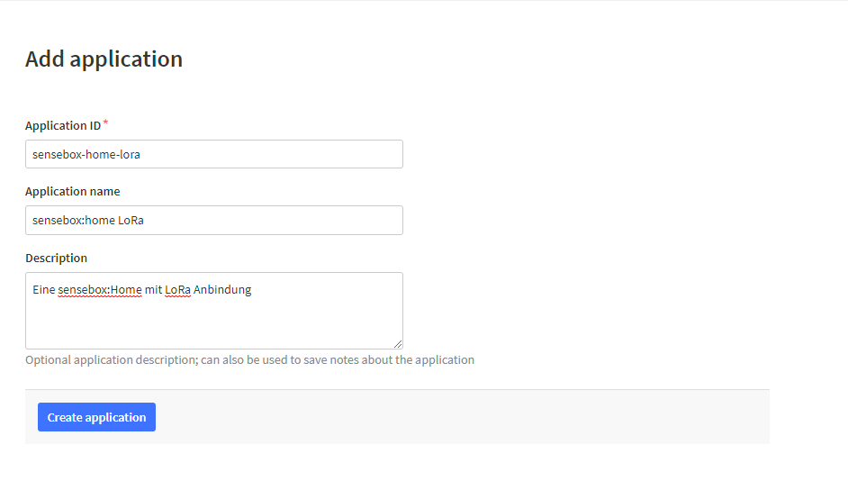

Nach einem Klick auf **Add Application** gelangst du auf die Übersichtsseite.

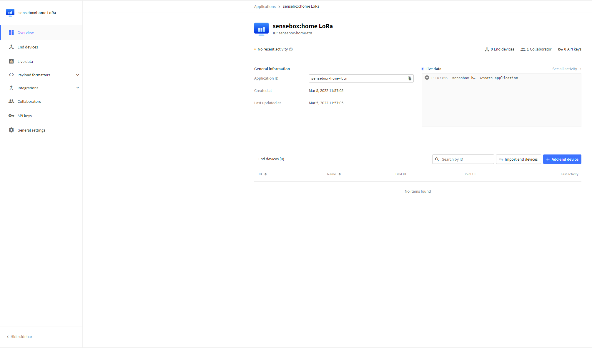

Innerhalb einer Application können nun mehrere Devices registriert werden. Klicke dazu auf **+ Add end device**.

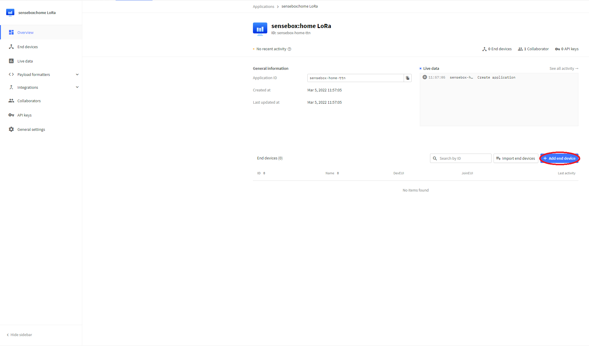

Klicke jetzt oben auf **Manually** und übernehme dann die Angaben die im Bild markiert sind. Anschließend generierst du die **DeviceEUI** und den **AppKey** über die entsprechenden Schaltflächen und klickst bei der **AppEUI** auf **Fill with zeros**
Abschließend kannst du dem Device noch eine ID geben, oder die vorgefertigte ID nutzen. Klicke auf **Register end device**

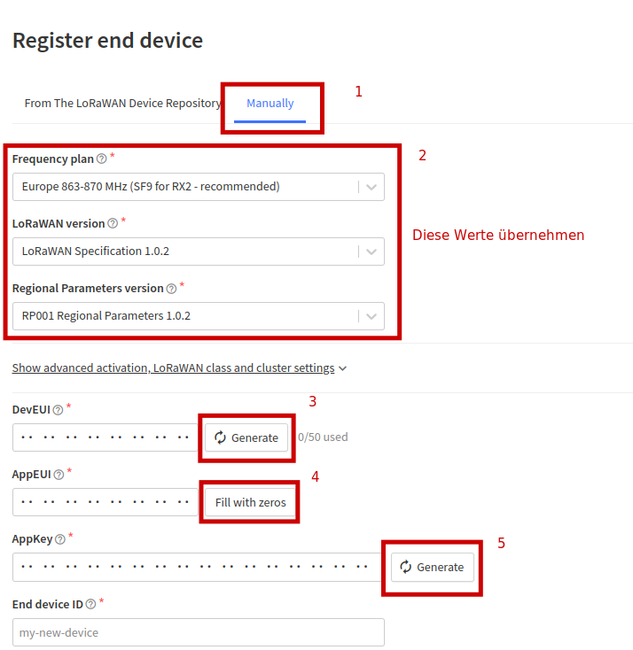

### Anlegen der openSenseMap Integration

Die Daten werden über das TheThingsNetwork als einfache Bytes versendet und werden von dort an die openSenseMap weitergeleitet. Damit diese Weiterleitung stattfinden kann, klicke in der Seitenleiste auf **Integrations** und dann auf **Webhooks** und lege anschließend über den Button **+ Add webhook** einen neuen Webhook an.

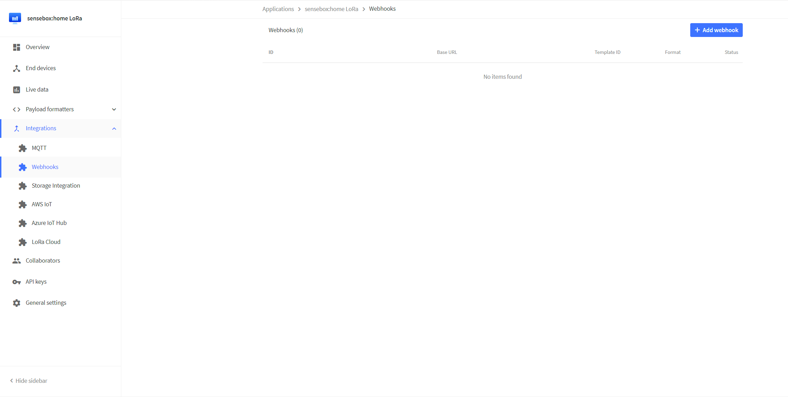

Für einige Dienste sind bereits vorgefertigte **Webhooks** angelegt. Für die Weiterleitung an die openSenseMap verwenden wir einen **Custom webhook** (das unterste Element in der Liste).

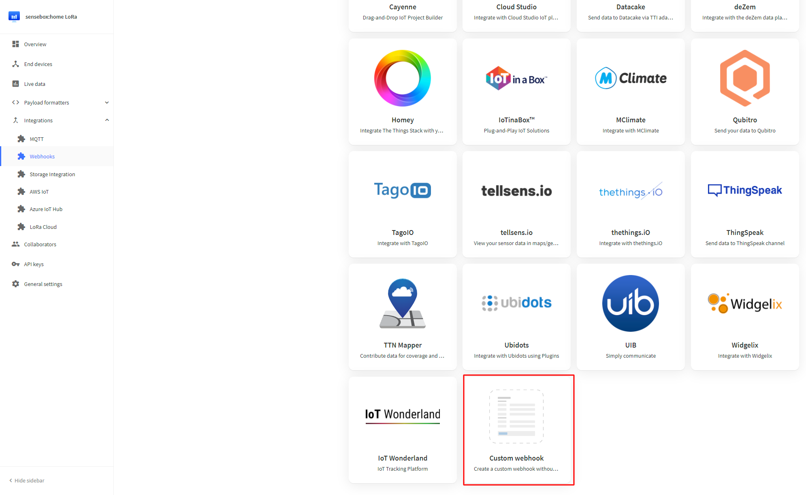

Gib der Integration einen Namen und trage ihn unter Webhook ID ein. Wähle als **Webhook Format** __JSON__ aus. Als URL für die Integration trage `https://ttn.opensensemap.org/v3` ein und setze unten das Häkchen bei **Uplink Message**, das Feld, das erscheint lässt du frei.

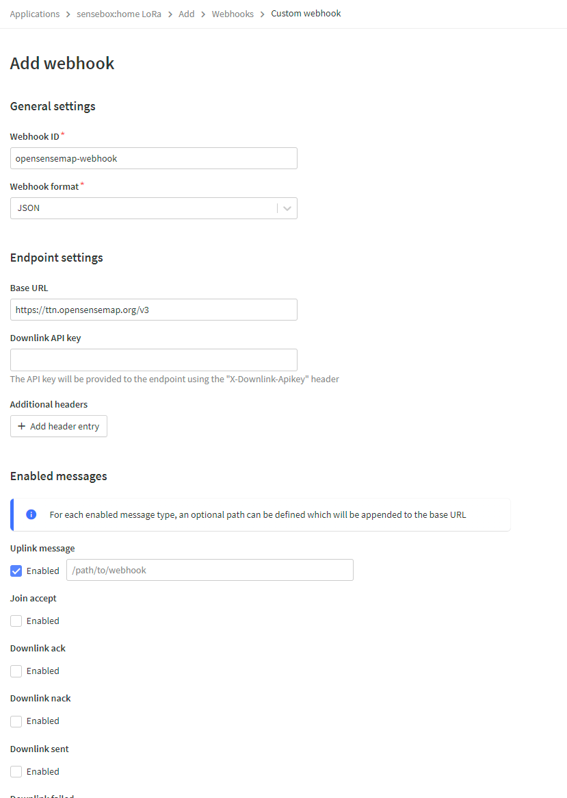

Jetzt klickst du auf **Register Webhook**.

Die Registrierung im TheThingsNetwork ist nun abgeschlossen.

## Registrieren auf der openSenseMap

Die Registrierung auf der openSenseMap erfolgt wie hier beschrieben. Wähle unter Verbindungsart "LoRa" aus und füge die Sensoren hinzu, die du im ersten Schritt an deine senseBox angeschlossen hast.

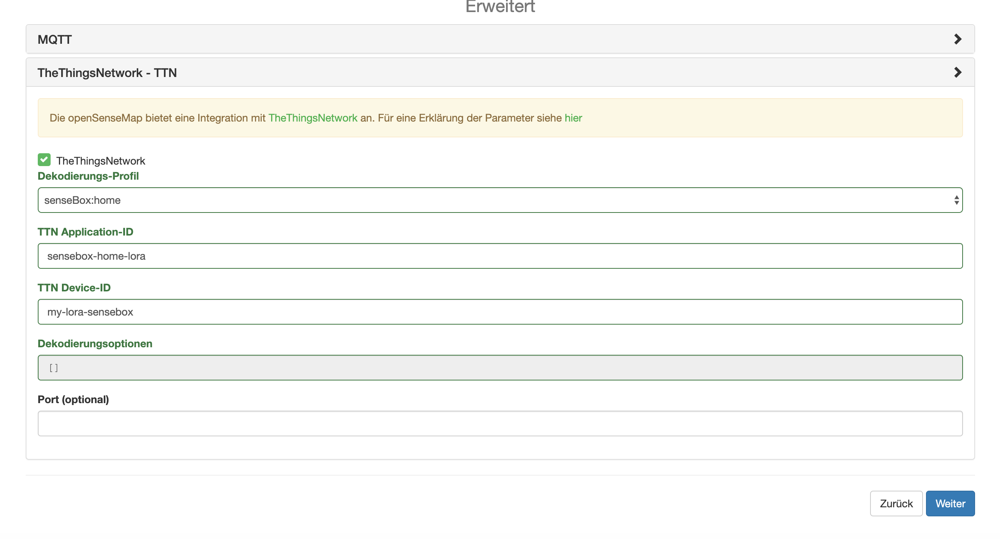

Damit die Verbindung zwischen dem TheThingsNetwork und der openSenseMap korrekt erfolgt, muss im nächsten Schritt noch **senseBox:home** als Dekodierungs-Profil ausgewählt werden. Füge noch deine TTN Application-ID und deine TTN Device-ID ein. Klicke auf weiter, um die Registrierung abzuschließen.

## Kompilieren und übertragen

Nach der Registrierung kannst du deinen Programmcode für die senseBox auf der openSenseMap kompilieren. Du musst daher keine Software auf dem Computer installieren.

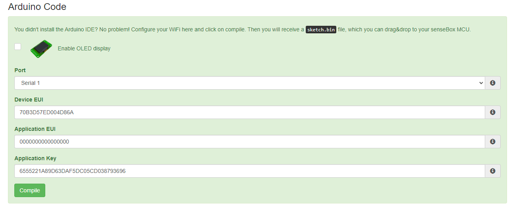

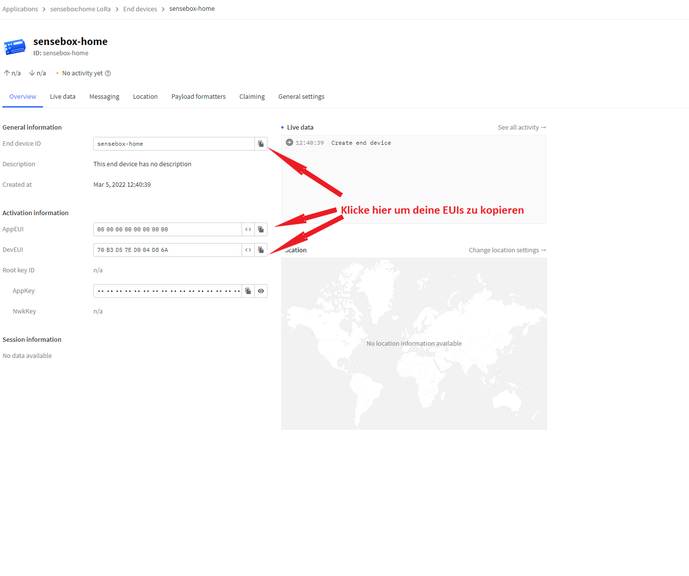

Kopiere die Device EUI, die Application EUI und den Application Key aus der Device-Übersicht und füge diese in die entsprechenden Felder ein und drücke anschließend auf "Kompilieren".

### Kopieren auf die senseBox

Bringe die senseBox durch einen Doppelklick auf den roten Resetbutton in den Lernmodus. Die senseBox taucht nun als Wechseldatenträger auf und du kannst das zuvor heruntergeladene Programm auf die senseBox kopieren. Anschließend startet die senseBox automatisch neu und die Daten werden übertragen.

>Beachte: Unter MacOS funktioniert das Kopieren der .BIN per Drag & Drop leider nicht. Am einfachsten funktioniert es mit unserem senseBox-Sketch Uploader. Einfach die Zip-Datei entpacken und das Programm starten. Das Programm kannst du [hier](https://sensebox.de/docs/senseBox_Sketch_Uploader_DE.zip) direkt herunterladen. Alternativ kannst du die Datei auch über [MuCommander](https://www.mucommander.com/) oder über das Terminal mittels `dd` kopieren (empfehlen wir allerdings nur erfahrenen Nutzer:innen).

## Probleme

Sollten deine Daten nicht auf der openSenseMap angezeigt werden, solltest du als erstes Überprüfen, ob die Daten im TheThingsNetwork ankommen. Dies kannst du ganz einfach von der Übersichtsseite deiner Application machen. Hier sollten nun unter **Live Data** immer wieder Nachrichten auftauchen, die mit **Forward Uplink Data message** gekennzeichnet sind.

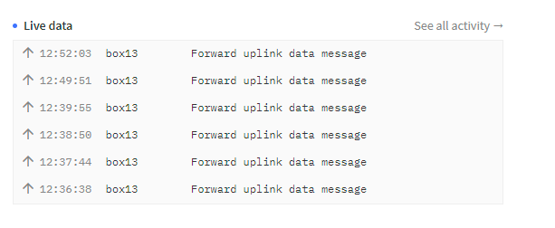

Sollten Daten in der Console auftauchen, diese allerdings nicht an die openSenseMap weitergeleitet werden, überprüfe, ob alle Parameter für die Integration von TTN auf der openSenseMap richtig kopiert worden sind. Die Parameter findest im Dashboard der openSenseMap.

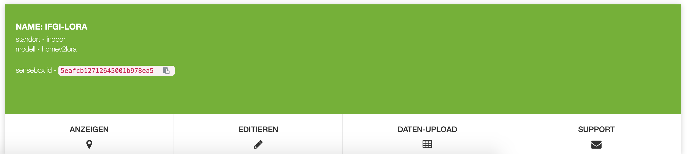

Klicke bei deiner senseBox auf "Editieren" und wähle anschließend im Seitenmenü "TheThingsNetwork" aus.

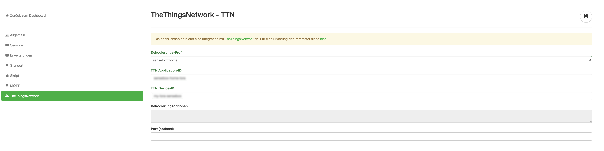
