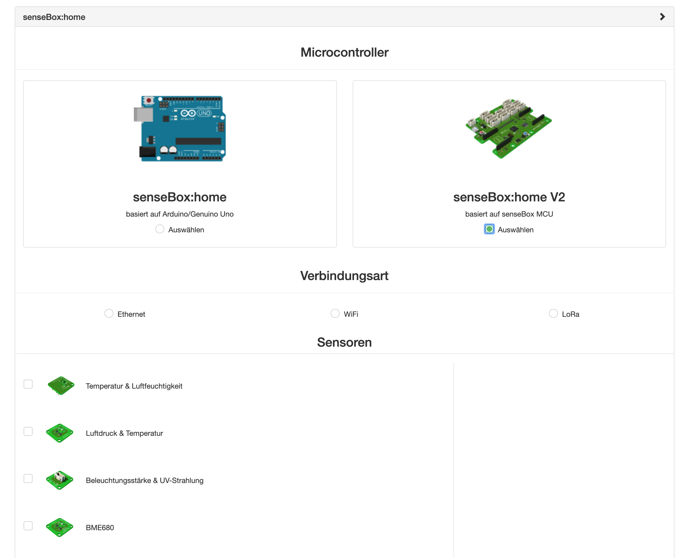
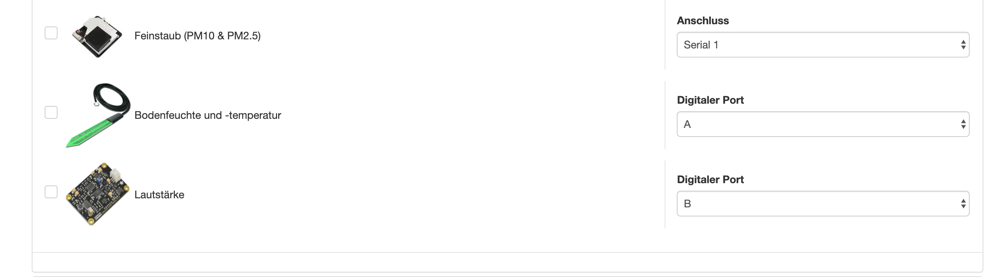

# Schritt 2: Registrieren auf der openSenseMap

Nachdem deine Messstation zusammengebaut wurde, wird diese auf der [openSenseMap](https://opensensemap.org) registriert.

Die openSenseMap ist eine Plattform, um Sensordaten zu speichern, zu vergleichen und zu visualisieren. Schau sie dir doch einfach mal an. Gehe auf [www.opensensemap.org](https://www.opensensemap.org) und entdecke einen riesigen Pool an Sensordaten aus der ganzen Welt. Nicht nur senseBoxen senden Daten an die openSenseMap, sondern auch andere Microcontroller mit Sensoren. Wie die einzelnen Funktionen der openSenseMap und ihre Schnittstellen funktionieren, findest du [hier](https://docs.sensebox.de/opensensemap/).

## 1. Nutzeraccount Registrierung
Gehe auf [www.opensensemap.org](https://www.opensensemap.org) und lege dir einen Account an. Dafür klickst du rechts oben in der Ecke auf "Login" und gehst dann auf "Sign up". Du brauchst zum Registrieren eine gültige E-Mail-Adresse. Nach erfolgreicher Registrierung erhältst du eine E-Mail mit einem Bestätigungslink. Bitte klicke den Link, um die Registrierung abzuschließen.

## 2. Eine neue senseBox anlegen
Nach der erfolgreichen Registrierung kannst du damit beginnen, deine senseBox anzulegen. Klicke dafür auf "New senseBox / Neue senseBox" in deinem Menü und bestätige die Nutzungsbedingungen. Befolge danach die Anweisungen der Registrierung und gebe folgende Daten an:

* Einen frei wählbaren Namen der senseBox
* Die Umgebung (Exposure), in der du deine senseBox aufstellen möchtest
* Den Ort (Location), an dem du deine senseBox aufstellen möchtest (du kannst deinen Standort auch automatisch bestimmen lassen)

Da die openSenseMap offen für alle Arten von senseBoxen ist, wirst du nach der verwendeten Hardware gefragt. Wähle *senseBox:home V2* und das Datenübertragungsmodul, das du verwendest. Möchtest du deine Daten über LoRa an die openSenseMap schicken, wählst du bei "Verbindungsart" LoRa aus. Anschließend kannst du im Reiter "Erweitert" deine Lora-Einstellungen angeben. Hier musst du die Application-ID und Device-ID eintragen, welche du beim [TheThingsNetwork](www.thethingsnetwork.org) angegeben hast. Weitere Informationen dazu findest du hier [hier](/sensebox-home-erweiterungen/home-erweiterung-lora/).

Bei einigen Sensoren musst du noch auswählen, an welchen Port du diese angeschlossen hast.

## 3. Summary der Registrierung und Mail erhalten
Wenn du die Registrierung abgeschlossen hast, musst du noch einmal der Veröffentlichung deiner Daten zustimmen. Danach erhälst du eine Übersicht deiner Registrierung. Dort wird dir deine senseBox-ID, deine Sensoren-IDs und der Arduino Code angezeigt.

Die senseBox-ID ist ein eindeutiger Identifikator deiner senseBox. Damit kannst du deine senseBox z.B. über die URL finden (opensensemap.org/explore/HIER-DEINE-SENSEBOX-ID-EINGEBEN) oder in Datensätzen aufspüren. Des Weiteren wird sie für verschiedene Applications und Funktionen rund um die senseBox und die openSenseMap verwendet.
